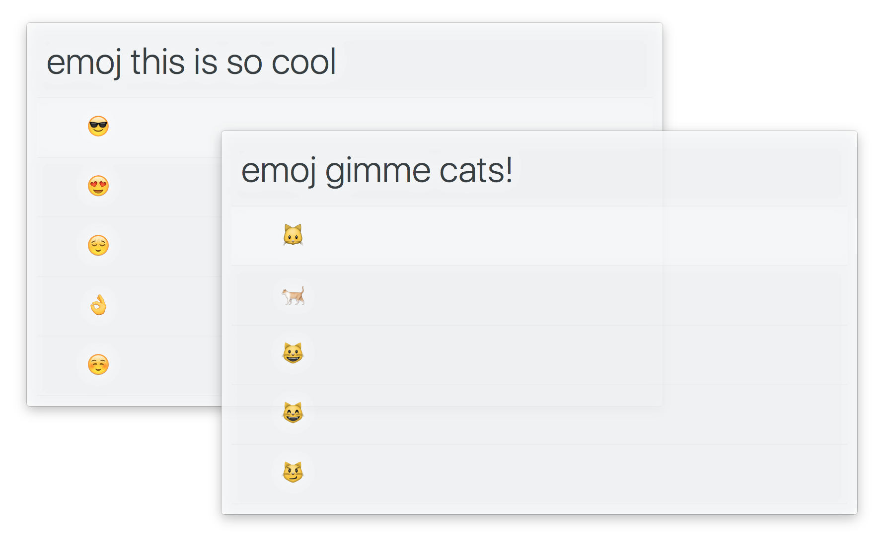

# alfred-emoj 

> [Alfred 3](https://www.alfredapp.com) workflow to find relevant emoji from text

Uses the API from this great article on [Emoji & Deep Learning](http://getdango.com/emoji-and-deep-learning.html). 
Check out the [Dango app](http://getdango.com) if you want something like this on your phone.

## Install

[Install the workflow.](http://www.packal.org/workflow/emoj)

*Requires [Node.js](https://nodejs.org) 4+ and the Alfred [Powerpack](https://www.alfredapp.com/powerpack/).*

## Usage

In Alfred, type `emoj`, <kbd>Enter</kbd>, and some text, to find relevant emoji.

Select an emoji and press <kbd>Enter</kbd> to copy it to the clipboard.

When at the top, press <kbd>▲</kbd> and <kbd>Enter</kbd>, to copy all the emoji.

## Related

- [emoj](https://github.com/sindresorhus/emoj) - Find relevant emoji from text on the command-line
- [alfred-npms](https://github.com/sindresorhus/alfred-npms) - Search for npm packages with npms.io
- [alfred-simple](https://github.com/sindresorhus/alfred-simple) - Simple theme
- [alfy](https://github.com/sindresorhus/alfy) - Create Alfred workflows with ease

## License

MIT © [Sindre Sorhus](https://sindresorhus.com)
