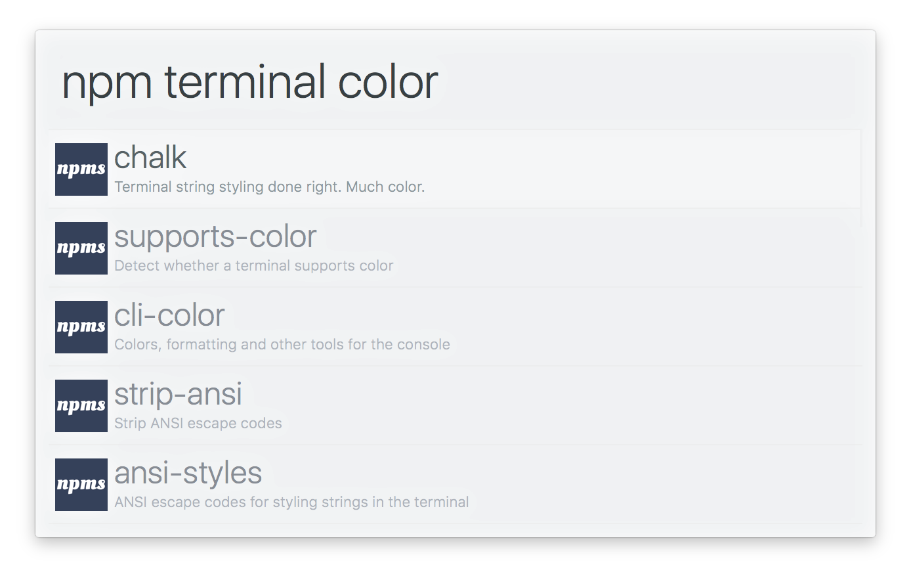

# alfred-npms 

> [Alfred 3](https://www.alfredapp.com) workflow to search for npm packages with [npms.io](https://npms.io)

npms.io is a great npm package search with deep analysis of package quality using a myriad of metrics. Much better than the official npmjs.com search.

## Install

[Install the workflow.](http://www.packal.org/workflow/npms-0)

*Requires [Node.js](https://nodejs.org) 4+ and the Alfred [Powerpack](https://www.alfredapp.com/powerpack/).*

## Usage

In Alfred, type `npm`, <kbd>Enter</kbd>, and your query, to search for packages.

Select a package and press <kbd>Enter</kbd> to go to its GitHub repo. 
Hold <kbd>Alt</kbd> when pressing <kbd>Enter</kbd> to go to its npm page. 
Press <kbd>Shift</kbd> to view its readme in Quick Look.

## Related

- [alfred-emoj](https://github.com/sindresorhus/alfred-emoj) - Find relevant emoji from text
- [alfred-simple](https://github.com/sindresorhus/alfred-simple) - Simple theme
- [alfy](https://github.com/sindresorhus/alfy) - Create Alfred workflows with ease

## License

MIT © [Sindre Sorhus](https://sindresorhus.com)
